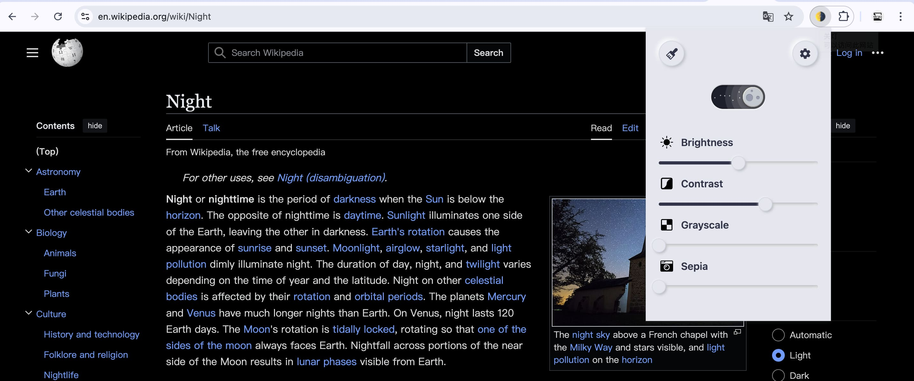

## dimmer

> 👋 Chrome 扩展程序，暗黑模式一键切换。「关灯」提供便捷的暗黑模式体验。一键开启后，您的浏览器界面将瞬间切换为深色主题，有效减轻眼部疲劳，同时为您的浏览增添一份神秘与优雅。该扩展兼容性强，适用于绝大多数网站，确保您在享受暗黑模式的同时，不会错过任何重要信息。chrome 扩展商店搜「[关灯](https://chromewebstore.google.com/detail/lights-off%E5%85%B3%E7%81%AF/dnidbhhpcjgffjophhebfelbcnonoclh)」，立即安装，带你沉浸深邃之域！

## 特点

❇️ 极致小巧，核心代码实现只有不到 3KB  

❇️ 新拟物化 UI 设计，尽显优雅格调 

❇️ 纯粹至极，仅专注于实现必要功能，依赖精简，技术运用恰到好处  

❇️ 安全并且谨慎，仅获取读取 TAB 页面信息权限，用于注入样式。绝不触及任何其他权限与信息  

❇️ 永久免费，这是一个开源项目，随时可以查看最新的源代码  

## 初衷

制作关灯这个工具的初衷，是源于我自身的情况。我有 [干眼症](https://zh.wikipedia.org/wiki/%E4%B9%BE%E7%9C%BC%E7%97%87) （一种常见的眼科疾病，长时间看电子屏幕导致，主要表现是眼睛干涩、畏光），又经常在晚上浏览页面，所以需要一个这样的工具。基于此，我开发了它，并发布到了 Chrome 商店。希望这个工具可以为有同样需求的朋友们提供便利。 

## 资源

- 中文版扩展商店：[关灯](https://chromewebstore.google.com/detail/%E5%85%B3%E7%81%AF/dnidbhhpcjgffjophhebfelbcnonoclh?hl=zh)
- 英文版扩展商店：[dimmer](https://chromewebstore.google.com/detail/%E5%85%B3%E7%81%AF/dnidbhhpcjgffjophhebfelbcnonoclh?hl=en)
- [国内镜像安装](https://www.ilovechrome.com/extension/dnidbhhpcjgffjophhebfelbcnonoclh)(版本更新不及时，不能体验到最新版，不推荐)

## 推荐

- 被 Chrome 官方标记为 **精选** 扩展：精选扩展程序遵循了我们的技术 [最佳做法](https://developer.chrome.com/docs/webstore/best-practices?hl=zh-cn)，并在用户体验和设计方面达到了较高的标准
- 阮一峰周刊工具类推荐：[24-11-15 期](https://www.ruanyifeng.com/blog/2024/11/weekly-issue-325.html)

## 感谢

😄 关灯这个名字来自 [@chocovon](https://github.com/chocovon) 的创意，非常感谢。

## 版本

- **v1.0.0**

  1.发布 mvp 版本

- **v1.0.1**

  1.调整并优化操作界面，更改为新拟物化设计

  2.去除一些调试代码、调整文本样式

- **v1.0.3**

  1.优化 video 和 img 标签上的颜色变换

- **v1.0.4**

  1.支持刷新后保持原来皮肤功能

  2.填充部页面无背景色部分情况

- **v1.0.5**

  1.按照谷歌新扩展规定，调整权限申请和描述

  2.优化代码书写风格

- **v1.1.0**

  1.manifest_version 支持第 3 版本，支持 google extension 商店要求

  2.对 popup ui 进行优化，使用体验更专注

- **v1.1.1**

  1.ui 优化

  2.修复全屏视频的异常显示效果

- **v1.1.2**

  1.目录结构优化，对静态资源和业务逻辑进行区分

  2.精简计划，去除或者归档一些不再使用的静态资源

- **v2.0.0**

  1.全新的 UI 和 交互逻辑

  2.新增全局模式功能、亮度、对比度、灰度、复刻色调自定义调节

  3.技术栈重构，使用 react + vite + ts

- **v2.0.1**

  1.修复 [脚手架工具](https://github.com/guocaoyi/create-chrome-ext) 在 Chrome 130 版本上无法进行 content script 注入问题，参考 [github issue](https://github.com/crxjs/chrome-extension-tools/issues/918) 和 [chromium issue](https://issues.chromium.org/issues/363027634?pli=1)

- **v2.0.2**

  1.修改描述以符合 chrome 扩展商店要求

  2.修复多语言切换时，元素跳动问题

- **v2.0.3**

  1.自定义滤镜设置支持局部存储和全局存储

  2.全局存储逻辑进行优化，默认使用当前页面配置

- **v2.1.0**  *(2015-03-18)*

  1.新增全局模式下忽略域名设置

  2.优化了暗黑模式状态的获取路径

  3.新增了版本标识
