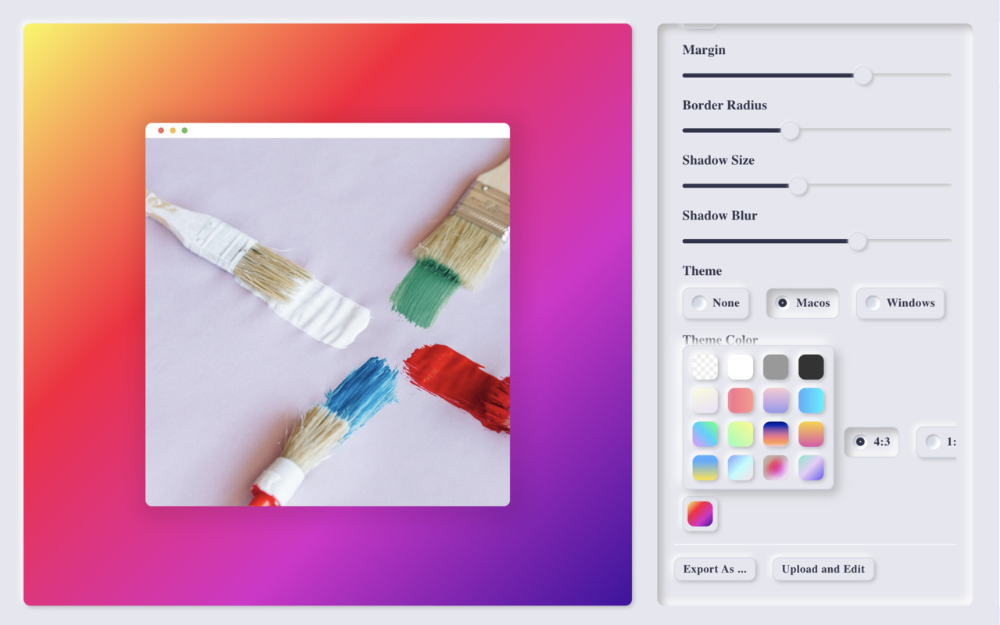
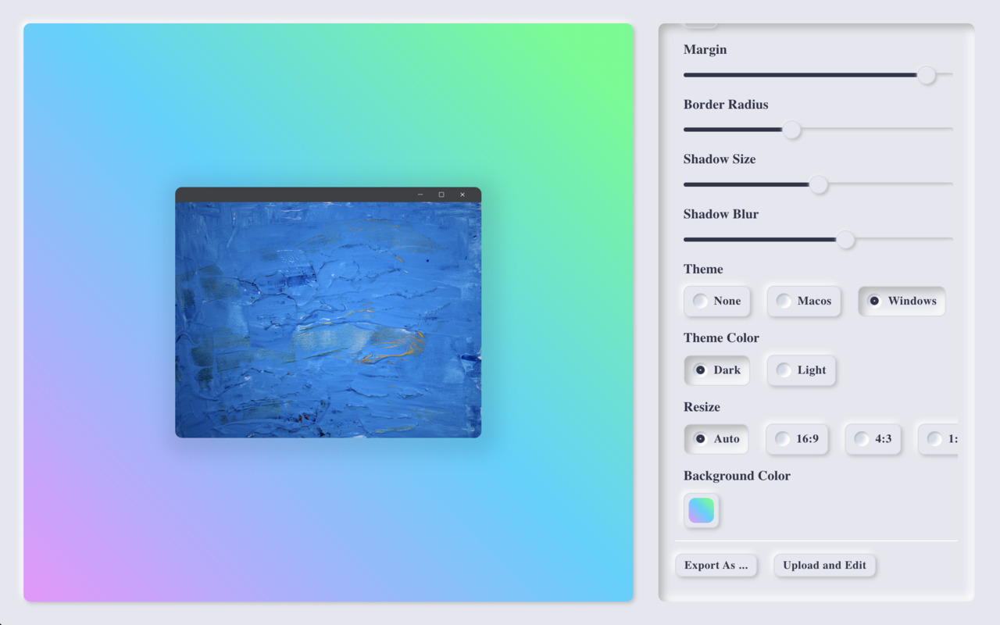

# Colora

> Colora is an incredibly lightweight, pure, and entirely free screenshot enhancement tool that refrains from abusing permissions. It employs the most basic yet effective technologies, all without any ads. Its core logic is impressively compact, weighing in at less than 5 KB. [Colora in Chrome EXT Store](https://chromewebstore.google.com/detail/colora-screenshot-and-edi/lajfgofeklkfhemnhomepdojkkljljkp?hl=zh-CN)

<div style="display: flex;"></div>


## Installing

1. Check if your `Node.js` version is >= **14**.
2. Change or configurate the name of your extension on `src/manifest`.
3. Run `npm install` to install the dependencies.

## Developing

run the command

```shell
$ cd colora

$ npm run start
```

### Chrome Extension Developer Mode

1. set your Chrome browser 'Developer mode' up
2. click 'Load unpacked', and select `colora/build` folder

### Nomal FrontEnd Developer Mode

1. access `http://localhost:3000/`
2. when debugging popup page, open `/popup.html`
3. when debugging options page, open `/options.html`

## Packing

After the development of your extension run the command

```shell
$ npm build
```

Now, the content of `build` folder will be the extension ready to be submitted to the Chrome Web Store. Just take a look at the [official guide](https://developer.chrome.com/webstore/publish) to more infos about publishing.

---

Generated by [create-chrome-ext](https://github.com/guocaoyi/create-chrome-ext)
