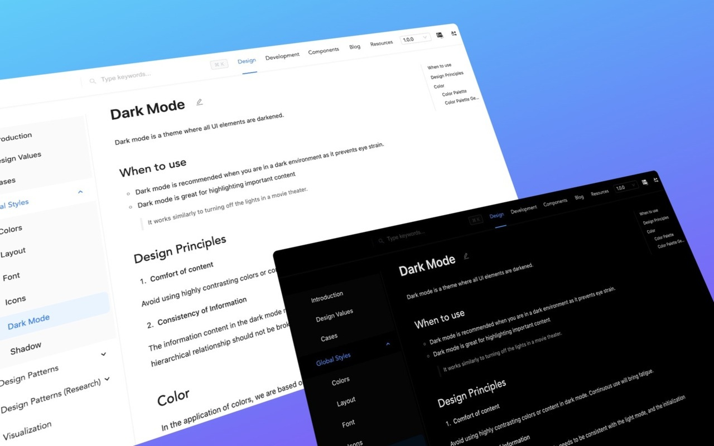

## dimmer

> 👋 Chrome 扩展程序，暗黑模式一键切换。「关灯」提供便捷的暗黑模式体验。一键开启后，您的浏览器界面将瞬间切换为深色主题，有效减轻眼部疲劳，同时为您的浏览增添一份神秘与优雅。该扩展兼容性强，适用于绝大多数网站，确保您在享受暗黑模式的同时，不会错过任何重要信息。chrome 扩展商店搜「[关灯](https://chromewebstore.google.com/detail/lights-off%E5%85%B3%E7%81%AF/dnidbhhpcjgffjophhebfelbcnonoclh)」，立即安装，开启您的暗黑模式之旅吧！

## 特点

❇️ 他足够小，核心代码实现只有不到 3KB  

❇️ 轻量化，他没有任何依赖，仅使用原生 CSS 实现  

❇️ 安全并且谨慎，仅获取读取 TAB 页面信息权限，用于注入样式。不会获取任何其他的权限和信息  

❇️ 永久免费，这是一个开源项目，随时可以查看最新的源代码  

❇️ 制作他的初衷是我有干眼症并且经常晚上浏览页面，自己需要这样的一个工具，后来发布到 Chrome 商店。希望可以方便到有需要的朋友  

## 介绍

迫于晚上看网页太亮，本人还有干眼症！就想做一个网页扩展使用。

了解下实现方案，发现有个非常简单的属性可以操作，主要使用`css3`的`filter`滤镜属性`invert(1) hue-rotate(180deg)`来实现，`invert`控制页面元素颜色反转，默认值是`0`，完全反转是`1`，`hue-rotate`用于给图片设置颜色反转，`0`是无变化，`180deg`是完全反转，超过`360deg`的值相当于又绕一圈。也算是复习一下 chrome 扩展相关知识并学习一下 sketch 软件，耗时一天实现了一个简单版本。并发布到 chrome 扩展商店。

😄 关灯这个名字来自`v2ex`的`@chocovon`的创意，非常感谢。

## 资源

- [谷歌商店安装](https://chromewebstore.google.com/detail/lights-off%E5%85%B3%E7%81%AF/dnidbhhpcjgffjophhebfelbcnonoclh)
- [国内镜像安装](https://www.ilovechrome.com/extension/dnidbhhpcjgffjophhebfelbcnonoclh)(版本更新不及时，不能体验到最新版，不推荐)

## 版本

- **v1.0.0**

  1.发布 mvp 版本

- **v1.0.1**

  1.调整并优化操作界面，更改为拟物化按钮设计，体验更顺滑

  2.去除调试代码

- **v1.0.3**

  1.优化 video 和 img 标签上的颜色变换

- **v1.0.4**

  1.支持刷新后保持原来皮肤功能

  2.填充部页面无背景色部分情况

- **v1.0.5**

  1.按照谷歌新扩展规定，调整权限申请和描述

  2.优化源码书写风格

- **v1.1.0**

  1.manifest_version 支持第 3 版本，支持 google extension 商店要求

  2.对 popup ui 进行优化，使用体验更专注

- **v1.1.1**

  1.ui 优化，主要是拟物化边框的处理，更符合理想中的样子

  2.修复全屏视频的异常显示效果

- **v1.1.2**

  1.目录结构优化，对静态资源和业务逻辑进行区分

  2.精简计划，去除或者归档一些不再使用的静态资源

- v2.0.0

  1.全新的 UI 和 交互逻辑

  2.新增全局模式功能、亮度、对比度、灰度、复刻色调自定义调节

  3.技术栈重构，使用 react + vite + ts
